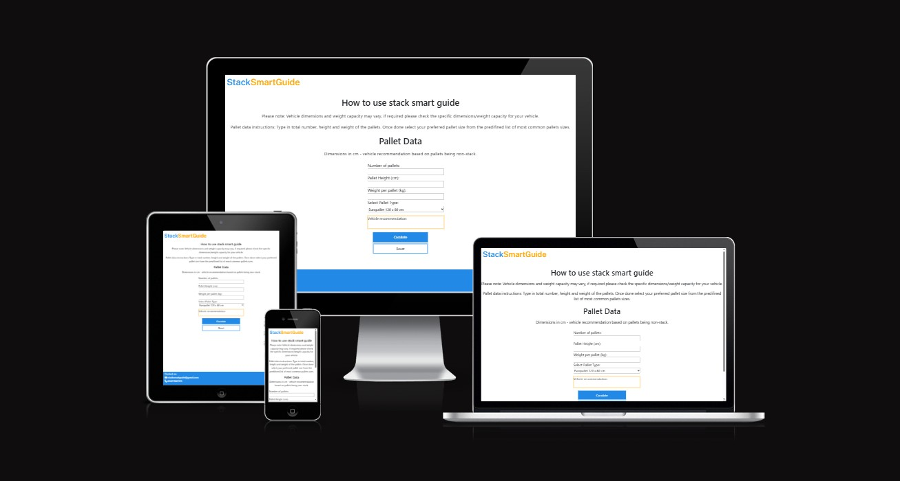
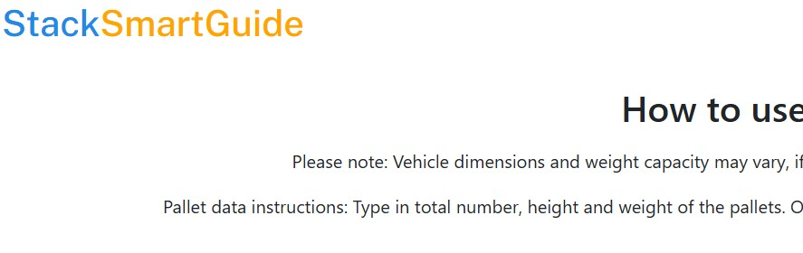
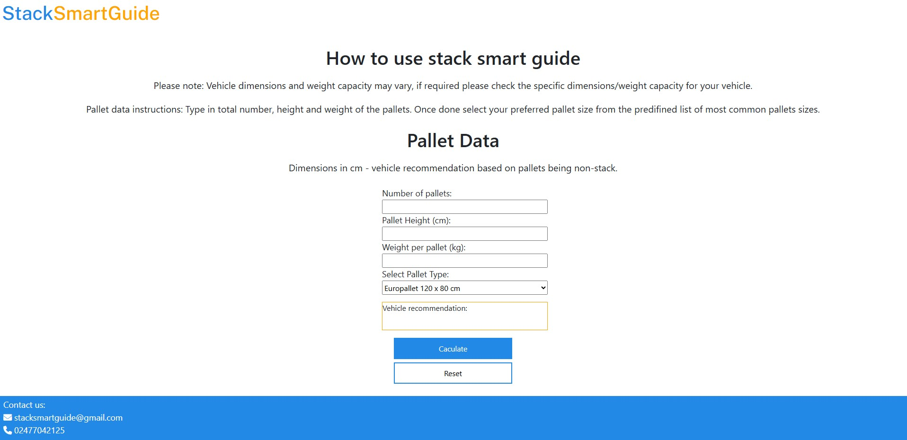

# Stack Smart Guide 

Stack smart guide is a web pallet calculator that provides logistics professionals with a recommended vehicle size based on cargo dimensions, weight and load height. The site analyses the data provided and suggests from small vans to large freight trucks depending on the size of the load. 

The site can be accessed by this [link](https://munashemuk2.github.io/StackSmartGuide/)

### Target audience:

- Transportation planners and freight forwarders 

### Purpose and Value of Stack Smart Guide to users: 

The site makes freight planning easier for logistics professionals as the guide suggests the ideal vehicle size based on the cargo they will be transporting.  In return, their planning will be more efficient, ensures safe transportation as goods will not be overloaded over the vehicle weight capacity and they will choose the right vehicle that fits all goods which reduces costs of sending replacement vehicles to their clients due to miscalculation errors. 

### Core Site Formula applied in JavaScript

 ### How to Determine if Pallets Fit in a Vehicle

 1.	Check the Total Pallet Length Against the Vehicle Length

- Multiply the length of a single pallet by the total number of pallets.
- If the combined pallet length is equal to or less than the van's length, proceed to check the width.
- If the total length exceeds the van’s length, rearrangement might be necessary.

2.	Adjust the Pallet Orientation to Fit the Space

- Pallets can be rotated to reduce the total length taken up inside the vehicle.
- Example: If a pallet is 120 cm (length) × 100 cm (width), it can be rotated so that the 100 cm width becomes the length instead, potentially making the load fit better.

3.	Check the Width of the Pallets Against the Vehicle Width

- After adjusting or confirming the length, check if pallets fit within the vehicle’s width.
- Apply the same logic: If width exceeds the van’s limit, consider rotating the pallets to balance the fit.

4.	Consider Stackability (If Applicable)

- If the pallets are stackable, multiply the height of one pallet by the number stacked until reaching the vehicle’s height limit.
- StackSmartGuide does not account for stackable pallets, so this step is omitted in its calculations.

### Final Decision

- If the combined pallet dimensions fit within the vehicle’s length, width, and height, then the vehicle is suitable.
- If not, a larger vehicle may be needed.

### Total volume

Total pallet dimensions = Length × Width × Height
-	Length: The length of the pallet.
-	Width: The width of the pallet.
-	Height: The height of the pallet.

For example: 
120cm (length) × 100cm (width) × 150 cm (height) = 1,800,000 cubic centimetres (cm³)
Total volume was also used in JS to recommend the appropriate vehicle size, ensuring efficient and safe transportation.

---

### User stories:

_First time visitors_

1. As a logistics professional I want a simple and intuitive, easy-to-use platform that simplifies complex logistics calculations.

2. As a logistics professional I want key dimensions unit inputs that ensure the correct sized vehicle is recommended 

3. As a logistics professional I want to see Stack Smart Guide’s contact details in case I have any questions on how to use the guide tool 

_Returning visitors_

1. As a logistics professional, I want accurate cargo calculations and vehicle recommendations to ensure optimal transport solutions.

2. As a logistics professional, I want to see updated features 

3.	As a logistics professional, professional I want to see Stack Smart Guide’s contact details in case there are any issues with the calculator

_Frequent users_

1. As a logistics professional I want consistent and dependable results for freight planning

## Features

+ ### Logo

    - Placed at the top of the page is the company logo "StackSmartGuide" on the left

    

---

+ ### Home Page

    - Features: 

    

        * Guide introduction with steps on how to use the guide 
        * Form with inputs/ select options to collect data for vehicle recommendation 
        * Calculate button to show results based on user inputs and reset button to bring form back to its initial state and allow user to fill in new information 

  

---

+ #### Footer

    - Footer contains a contact email and number to allow users to report issues and ask questions on how to effectively use the guide
​
    
​
---
## Technologies Used

- [If else statements](https://www.shecodes.io) - Used to Access Properties Inside an Object for If Else Statements
- [VSCode](https://code.visualstudio.com/)  Used as the main code editor
- [GitHub](https://github.com/) code host for the site
- Code institute tutorials for understanding how to access elements in the DOM through JavaScript
---

### Solved bugs

1. Had an issue with the select options for the pallet types showing as strings despite the select type being number. Rectified this by adding .value to the variable in JavaScript and listing the pallet size dimensions 

2. The site buttons were not working on the page when trying to add an event listener for clicks in a form. Resolved this by taking out the form tags and putting the form data in a div container instead.

---
## Design

### Color Scheme

- The colour scheme for the site is blue, orange and white 

- Blue to instil user trust and convey reliability and professionalism so the site visitors feel assured about the accuracy of the information from the site. 

-	Orange to draw users’ attention to the logo and to highlight the vehicle recommendation output box 

- The white backgrounds make text and the site content clearer.

### Typography

- Chose open/public sans Google Font as they increase readability and clarity. Due to this it will be easy for users to scan through data and numerical values 

### Wireframes 

#### Mobile/Tablets/Desktop devices

- [Wireframe link](https://www.canva.com/design/DAGmeM5WMKw/qqw3YJhy_F9eNF_7kvYZpQ/edit)

---

## Testing

Please refer to the [TESTING.md](testing.md) file for all test-related information 

---

## Deployment

### Deployment to GitHub Pages

- The site was deployed to GitHub pages. Using the following steps: 
  - In the [GitHub repository](https://github.com/MunasheMuk2/StackSmartGuide), clicked on the Settings tab 
  - Selected the main branch under default branch and clicked on code 
  - Under deployments was a ribbon display to indicate the successful deployment.

The live link can be found [here](https://munashemuk2.github.io/StackSmartGuide/)

### Local Deployment

In order to make a local copy of this project clone it in your IDE Terminal using the following command:

- `git clone https://github.com/MunasheMuk2/StackSmartGuide`

---

## Future improvements
- Add more pallet types to the select options  
- Allow users to manually type in their pallet length and width

---

 #### Tools

    - [Favicon](https://favicon.io/favicon-converter/) generating an emoji fav icon 
    - [Canva](https://www.canva.com/) Wireframes created in canva
  
---

### Credits

All work done by myself - my two accounts MunasheMuk and MunasheMuk2 showing in error in git hub as contributors

## Acknowledgments

- [Code Institute](https://codeinstitute.net/) All slack community members willing to help at any time of the day. 

---