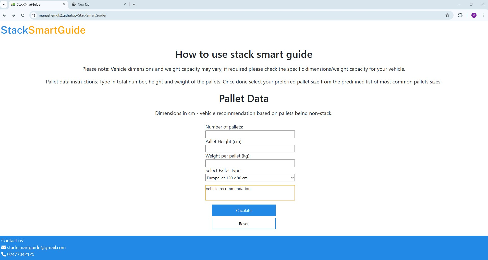
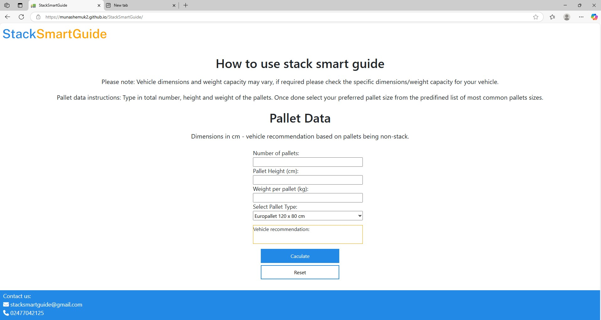
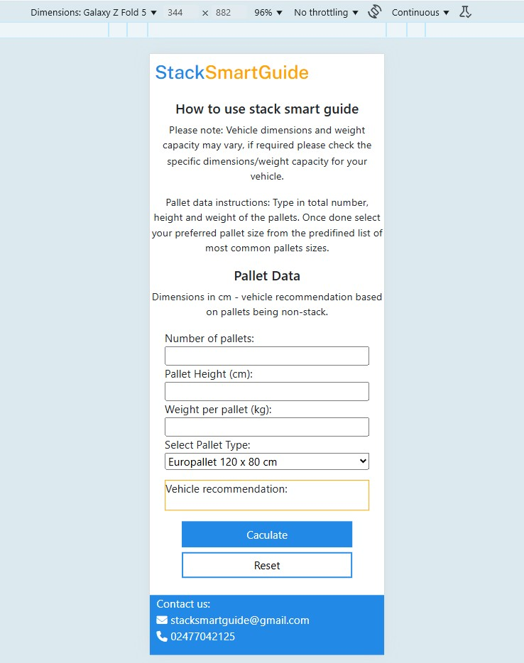
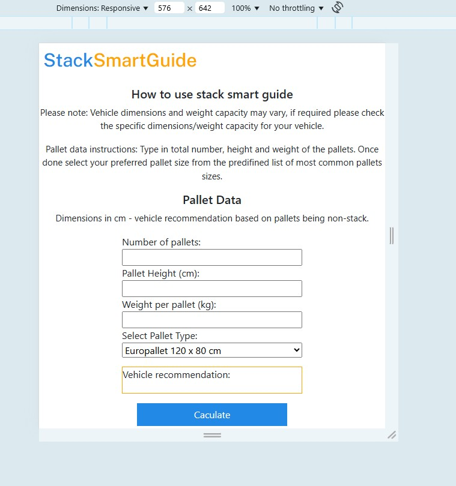
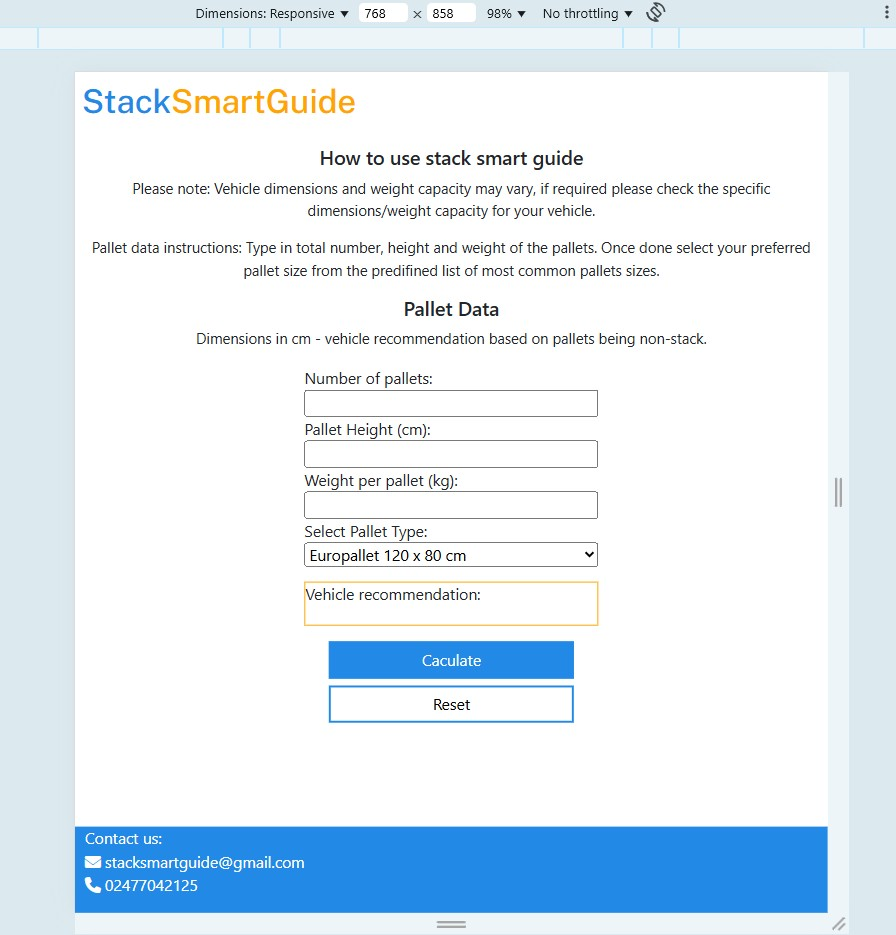
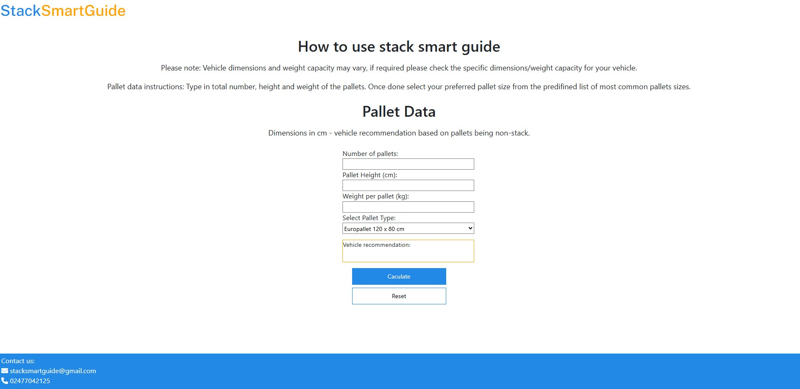
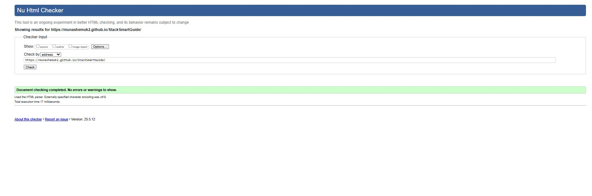
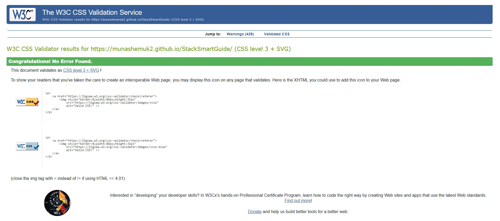
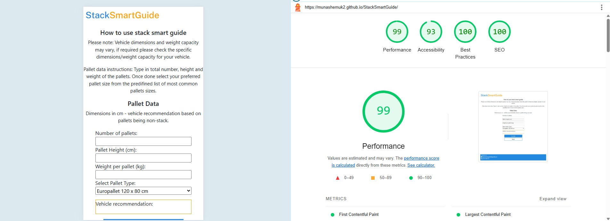

# TESTING

## Compatibility

In order to confirm the correct functionality, responsiveness, and appearance:

+ The website was tested on the most popular browsers : Chrome and internet explorer

    - Chrome:

    

     - Internet explorer:

    

---

## Responsiveness

+ Also checked the website's responsiveness in devtools - Chrome.

    - Extra small devices:

    

    ---

    - Small devices:

    

    ---

    - Medium devices:

    

    ---
    
     - large/Xl devices:

    
---
## Manual testing

| feature | action | expected result | tested | passed | comments |
| --- | --- | --- | --- | --- | --- |
| Pallet Data Form | | | | | |
| Number of pallets | Enter number | number is displayed | Yes | Yes | - |
| Pallet height | Enter number | number is displayed | Yes | Yes | - |
| Weight per pallet | Enter number | number is displayed | Yes | Yes | - |
| Select pallet type | Select one of the 2 predifined pallet types  | pallet type is displayed | Yes | Yes | - |
| Buttons | | | | | |
| Calculate button | Click on the calculate button | An output of a vehicle recommendation is displayed | Yes | Yes | - |
| Reset button| Click on the reset button| The pallet data form refreshes all numbers entered by user are reset | Yes | Yes | - |
---

## Validator testing
+ ### HTML
  #### Landing Page
   
    

     - No errors or warnings were found when passing through the official W3C validator.

    
+ ### CSS
  No errors or warnings were found when passing through the official W3C (Jigsaw) validator 
    

 ---

+ ## LightHouse report

    - Lighthouse in devtools confirmed the site has optimal perfoamce. See below: 
    
  ### Home page

  

---